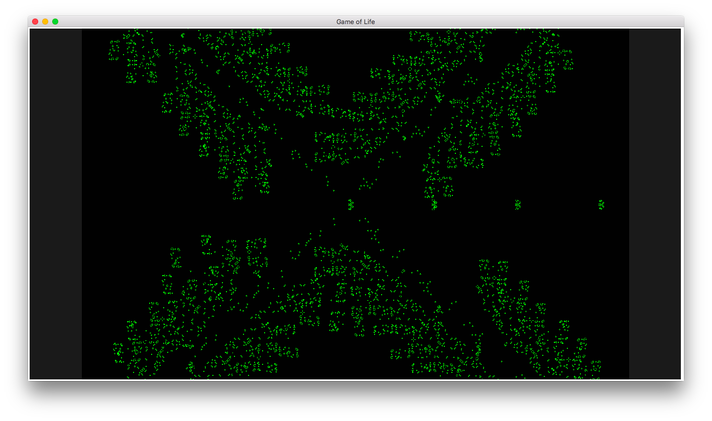
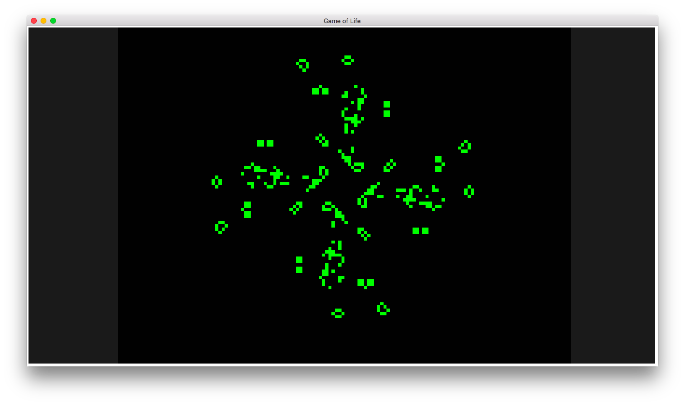

# GameOfLife
Pythonで[コンウェイのライフゲーム](https://ja.wikipedia.org/wiki/ライフゲーム)．

## 操作方法

左クリック: セルの生死を反転   
右クリック: 画面をスクロール  
上カーソルキー: 画面拡大   
下カーソルキー: 画面縮小   

右カーソルキー: 世代を次へ進める  
左カーソルキー: 世代を一つ戻す   
ESC: シミュレーションを初期状態に戻す

Z: FPSを下げる   
X: FPSを上げる   
A: フレームあたりの更新世代数を減らす   
S: フレームあたりの更新世代数を増やす   

I: 画面端で反対側にループするかどうかを切り替える   

## Demo

   
    

## Requirements

python >= 3.5.1  
pillow >= 3.2.0     
numpy >= 1.11.0
